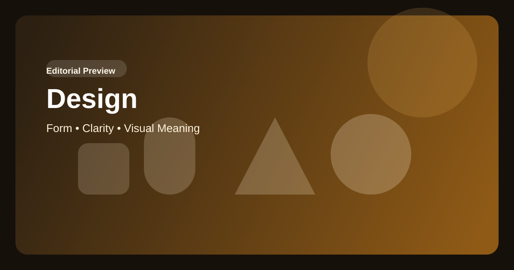

# Design / Design / Diseño / Дизайн / 设计 / التصميم

## English

Design is not decoration applied after meaning. It is the method by which complexity becomes readable, trusted and memorable.

Good design lowers friction, strengthens character and organizes perception. It makes a project feel intentional before a single argument is consciously processed.

For `Дом рекламы`, design must operate as intellectual discipline. A project speaking about new forms of advertising should also look structurally precise, contemporary and composed.

## Français

Le design n’est pas une décoration ajoutée après le sens. C’est la méthode par laquelle la complexité devient lisible, digne de confiance et mémorable.

Un bon design réduit la friction, renforce le caractère et organise la perception. Il donne au projet une impression d’intention avant même qu’un argument soit pleinement formulé.

Pour `Дом рекламы`, le design doit agir comme une discipline intellectuelle. Un projet qui parle de nouvelles formes de publicité doit aussi paraître précis, contemporain et structuré.

## Español

El diseño no es una decoración añadida después del sentido. Es el método mediante el cual la complejidad se vuelve legible, confiable y memorable.

El buen diseño reduce fricción, fortalece el carácter y organiza la percepción. Hace que un proyecto parezca intencional incluso antes de que el argumento sea procesado conscientemente.

Para `Дом рекламы`, el diseño debe funcionar como una disciplina intelectual. Un proyecto que habla de nuevas formas de publicidad también debe verse preciso, contemporáneo y bien compuesto.

## Русский

Дизайн — это не украшение, наложенное поверх смысла. Это способ сделать сложное читаемым, заслуживающим доверия и запоминающимся.

Хороший дизайн снижает трение, усиливает характер и организует восприятие. Он позволяет проекту выглядеть собранным еще до того, как человек осознанно разберет его аргументы.

Для `Дом рекламы` дизайн должен быть формой интеллектуальной дисциплины. Если проект говорит о новых формах рекламной деятельности, его визуальный язык тоже должен быть точным, современным и структурно ясным.

## 中文

设计不是在意义之后附加的装饰，而是让复杂性变得可读、可信且可记忆的方法。

好的设计能够降低摩擦、强化个性并组织感知。它会让一个项目在论点被完全理解之前，就先显得有意图、有秩序。

对 `Дом рекламы` 来说，设计必须作为一种智性纪律来运作。一个讨论广告新形态的项目，其视觉语言也必须精准、当代并且结构清晰。

## العربية

التصميم ليس زينة تُضاف بعد اكتمال المعنى، بل هو الطريقة التي تصبح بها التعقيدات قابلة للقراءة وموثوقة وقابلة للتذكر.

التصميم الجيد يخفف الاحتكاك، ويقوي الشخصية، وينظم الإدراك. فهو يجعل المشروع يبدو مقصودًا ومتماسكًا حتى قبل أن تُفهم حججه بشكل واعٍ.

وبالنسبة إلى `Дом рекламы`، يجب أن يعمل التصميم بوصفه انضباطًا فكريًا. فإذا كان المشروع يتحدث عن أشكال جديدة من النشاط الإعلاني، فيجب أن تكون لغته البصرية أيضًا دقيقة ومعاصرة ومنظمة.
