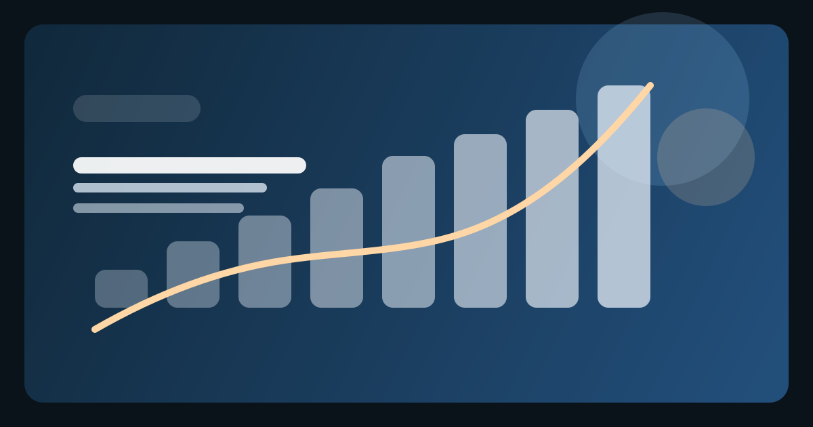

# Дом рекламы: operating map / 2026-05-15

Операционная карта дня: `2026-05-15`

## English

This map turns the `2026-05-15` stack into one operating entrypoint. The point is no longer to add isolated logic blocks. The point is to make the next rerank executable from one place.

The day is now structured as a sequence: readiness, trigger conditions, rerank protocol, candidate order, evidence thresholds, movement note, and rerank delta. That sequence is enough to move from signal to same-day public explanation without reopening the whole editorial system.

## Français

Cette carte transforme la pile du `15 mai 2026` en un seul point d’entrée opératoire. Le but n’est plus d’ajouter des blocs logiques isolés. Le but est de rendre le prochain rerank exécutable depuis un seul endroit.

La journée est désormais structurée comme une séquence: readiness, conditions de trigger, protocole de rerank, ordre des candidats, seuils de preuve, movement note et rerank delta. Cette séquence suffit pour passer du signal à une explication publique le jour même, sans rouvrir tout le système éditorial.

## Español

Este mapa convierte la pila del `15 de mayo de 2026` en un solo punto de entrada operativo. El objetivo ya no es añadir bloques lógicos aislados. El objetivo es hacer que el siguiente rerank sea ejecutable desde un solo lugar.

El día queda ahora estructurado como una secuencia: readiness, condiciones de trigger, protocolo de rerank, orden de candidatos, umbrales de evidencia, movement note y rerank delta. Esa secuencia basta para pasar de la señal a la explicación pública en el mismo día sin reabrir todo el sistema editorial.

## Русский

Эта карта превращает стек `2026-05-15` в одну рабочую точку входа. Задача уже не в том, чтобы добавлять отдельные логические блоки. Задача в том, чтобы следующий `rerank` можно было запускать из одного места.

Теперь день собран как последовательность: `readiness`, `trigger conditions`, `rerank protocol`, `candidate order`, `evidence thresholds`, `movement note`, `rerank delta`. Этой последовательности достаточно, чтобы пройти путь от сигнала до same-day публичного объяснения без повторного открытия всей редакционной системы.

## 中文

这张图把 `2026年5月15日` 的整套结构收束为一个操作入口。目标已经不再是继续添加孤立的逻辑块，而是让下一次 rerank 可以从一个地方被直接执行。

现在这一天已经被组织成一条顺序链：readiness、trigger conditions、rerank protocol、candidate order、evidence thresholds、movement note 与 rerank delta。这条链已经足以让我们从信号走到同日公开说明，而不必重新打开整个编辑系统。

## العربية

تحوّل هذه الخريطة حزمة `15 مايو 2026` إلى نقطة دخول تشغيلية واحدة. ولم يعد الهدف إضافة كتل منطقية منفصلة، بل جعل rerank التالي قابلاً للتنفيذ من مكان واحد.

وقد أصبح اليوم الآن منظّمًا كسلسلة: readiness وtrigger conditions وrerank protocol وcandidate order وevidence thresholds وmovement note وrerank delta. وهذه السلسلة تكفي للانتقال من الإشارة إلى تفسير علني في اليوم نفسه من دون إعادة فتح النظام التحريري كله.

## Последовательность дня

1. [ranking readiness](./2026-05-15-ranking-readiness.md)
2. [trigger matrix](./2026-05-15-trigger-matrix.md)
3. [rerank protocol](./2026-05-15-rerank-protocol.md)
4. [candidate order brief](./2026-05-15-candidate-order-brief.md)
5. [evidence threshold grid](./2026-05-15-evidence-threshold-grid.md)
6. [movement note scaffold](./2026-05-15-movement-note-scaffold.md)
7. [rerank delta scaffold](./2026-05-15-rerank-delta-scaffold.md)
8. [same-day rerank checklist](./2026-05-15-same-day-rerank-checklist.md)
9. [rerank simulation](./2026-05-15-rerank-simulation.md)
10. [scorecard refresh scaffold](./2026-05-15-scorecard-refresh-scaffold.md)
11. [trigger scenario / TikTok](./2026-05-15-trigger-scenario-tiktok.md)
12. [trigger scenario / Amazon Ads](./2026-05-15-trigger-scenario-amazon-ads.md)
13. [trigger scenario / OpenAI](./2026-05-15-trigger-scenario-openai.md)
14. [trigger scenario / Salesforce](./2026-05-15-trigger-scenario-salesforce.md)

## Что делает каждый слой

| Слой | Функция |
| --- | --- |
| `ranking readiness` | фиксирует, готов ли день к новому проходу |
| `trigger matrix` | определяет, какой сигнал вообще имеет право двигать рейтинг |
| `rerank protocol` | задает порядок действий после подтвержденного trigger |
| `candidate order brief` | дает предварительный порядок верхнего кластера |
| `evidence threshold grid` | отделяет слабый сигнал от достаточного и сильного |
| `movement note scaffold` | позволяет быстро выпустить короткое объяснение перестановки |
| `rerank delta scaffold` | фиксирует сравнение рейтинга до и после |
| `same-day rerank checklist` | проверяет, можно ли уже публиковать перестановку |
| `rerank simulation` | показывает, как весь стек сработает на реальном dry run |
| `scorecard refresh scaffold` | синхронизирует внутренние scorecards с публичной перестановкой |
| `trigger scenario / TikTok` | показывает первый конкретный live-case для same-day rerank |
| `trigger scenario / Amazon Ads` | показывает commerce-execution live-case для same-day rerank |
| `trigger scenario / OpenAI` | показывает AI-workflow live-case для same-day rerank |
| `trigger scenario / Salesforce` | показывает enterprise-workflow live-case для same-day rerank |

## Практический вывод

- день `2026-05-15` больше не является просто наблюдательным слоем;
- это уже рабочий оперативный стек для запуска следующего `Top 20`;
- следующий сильный публичный сигнал можно переводить в `same-day rerank` без дополнительной архитектурной подготовки.

## Связанные материалы

- [../../data/rankings/2026-05-15-operating-map.csv](../../data/rankings/2026-05-15-operating-map.csv)
- [./2026-05-15-ranking-readiness.md](./2026-05-15-ranking-readiness.md)
- [./2026-05-15-trigger-matrix.md](./2026-05-15-trigger-matrix.md)
